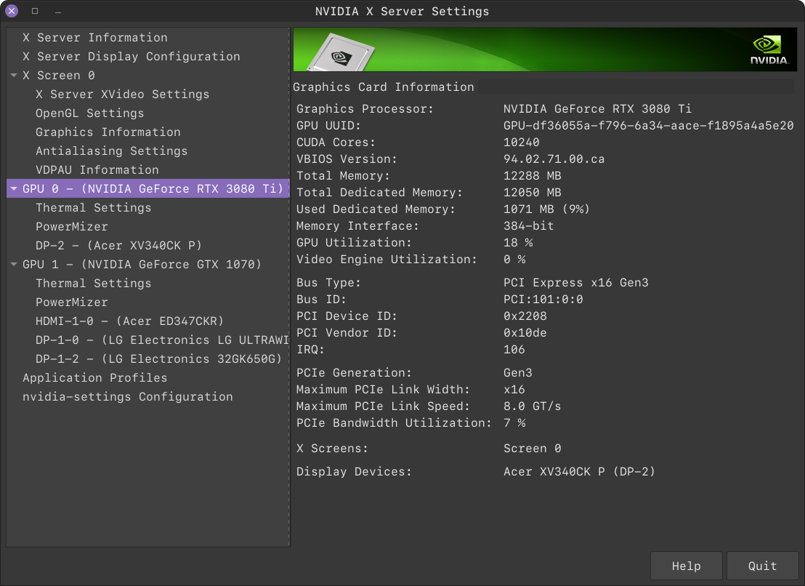

## **Enabling Multi-GPU Monitor Output in Linux with PRIME**

This repo will show how you can use multiple GPUs for video output in Linux.

My current system specs:

```
Operating System: Linux Mint 20.3 Cinnamon
Cinnamon Version: 5.2.7
Linux Kernel: 5.4.0-117-generic
Processor: Intel© Core™ i9-7900X CPU @ 3.30GHz × 10
Memory: 62.5 GiB
Graphics Cards: NVIDIA RTX 3080 Ti, NVIDIA GTX 1070

Display Configuration:

    RTX 3080 Ti:
        - Acer XV340CK P (3440x1440)

    GTX 1070:
        - LG 32GK650G (2560x1440)
        - LG Ultrawide (2560x1080)
        - Acer ED347CKR (3440x1440)
```
## **Steps**

1. Check to see that you have multiple providers with **`xrandr`**:
   
    **```$ xrandr --listproviders```**

    Move on to step 2 if you see provider 0 and 1 such as the following output:

    ```
    Provider 0: id: 0x1b8 cap: 0x1, Source Output crtcs: 4 outputs: 7 associated providers: 1 name:NVIDIA-0
    Provider 1: id: 0x35e cap: 0x2, Sink Output crtcs: 4 outputs: 8 associated providers: 1 name:NVIDIA-G0
    ```

    If you have more than 2 GPUs in your system (baller), you should open a github issue and let me know how 3 or more GPUs work out. I'm curious!

2. Remove existing Xorg configuration:

    **```$ sudo rm /etc/X11/xorg.conf```**
    
3. Modify **`/etc/default/grub`** to add new kernel parameter:

    **```$ sudo nano /etc/default/grub```**

    Add **`nvidia-drm.modeset=1`** inside the quotes for **`GRUB_CMDLINE_LINUX_DEFAULT`**
    
    This should look like the following:

    **`GRUB_CMDLINE_LINUX_DEFAULT="nvidia-drm.modeset=1 quiet splash rd.driver.blacklist=nouveau"`**
4. Set provider sources:

    **`sudo xrandr --setprovideroutputsource NVIDIA-G0 NVIDIA-0`**


5. Rebuild grub:

    **`$ sudo grub-mkconfig -o /boot/grub/grub.cfg`**

6. Reboot

After reboot, you should be able to see all of your monitors turned on as if they are plugged into a single GPU.


## **Sanity Check**

If you have gotten this far, I will show examples of what you should be seeing if everything was successful.


Check that nvidia-drm.modeset was enabled properly:

**`$ sudo cat /sys/module/nvidia_drm/parameters/modeset`**

This should just output `Y` if successful, `N` for unsuccessful.


**NOTE**: All display configuration changes should be done from the system display settings. Or if you know your way around xrandr, you can use that as well.

## **Nvidia X Server Settings**:

### Server Display Configuration


### GPU 0


### GPU 1


## Monitor Cable Layout


## Useful Links

1. Conversation between @Xeizzeth and @generix on nvidia developer forums

    [Manjaro Linux, trouble creating additional XScreen - forums.developer.nvidia.com](https://forums.developer.nvidia.com/t/manjaro-linux-trouble-creating-additional-xscreen/200434/3)

2. [How to add a kernel parameter - forums.linuxmint.com](https://forums.linuxmint.com/viewtopic.php?t=349669)

3. [Modeset=1 not detected - forum.endeavouros.com](https://forum.endeavouros.com/t/modeset-1-not-detected/29748/3)


## Final Notes

I added pdfs of the web pages I used for reference in case any of them ever go down. Head over to **`/webpage_pdfs`** in the repo.

Hope this helps!
